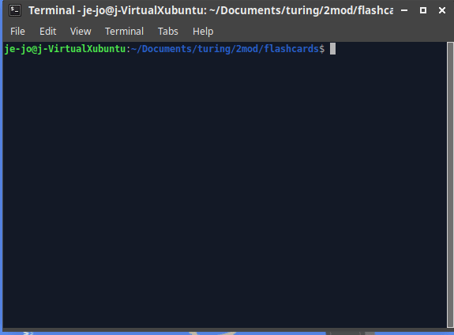

# FlashCards 

## Abstract

A Flash Cards game, playable through the CLI, featuring 30 questions about JavaScript! 

User will be prompted for each questions, have the opportunity to select an answer and see a final score at the end of the round.

This is a learning project from Turing School Module 2. The spec can be found [here](https://frontend.turing.edu/projects/module-2/flash-cards.html).

## Learning Goals

- Contribute code to an partially constructed application
- Implement a robust testing suite using TDD
- Write modular, reusable code that follows SRP (Single Responsibility Principle)

## Preview of App

## Technologies used

- JavaScript
- Mocha
- Chai

## Install instructions

- Clone down the repo.
- Run `npm install` to install dependencies.
- Run `node index.js` to start the game.

## Optional Extension

- [ ] Add functionality so that a score of less than 90% will require the user to go through the entire dataset again.

